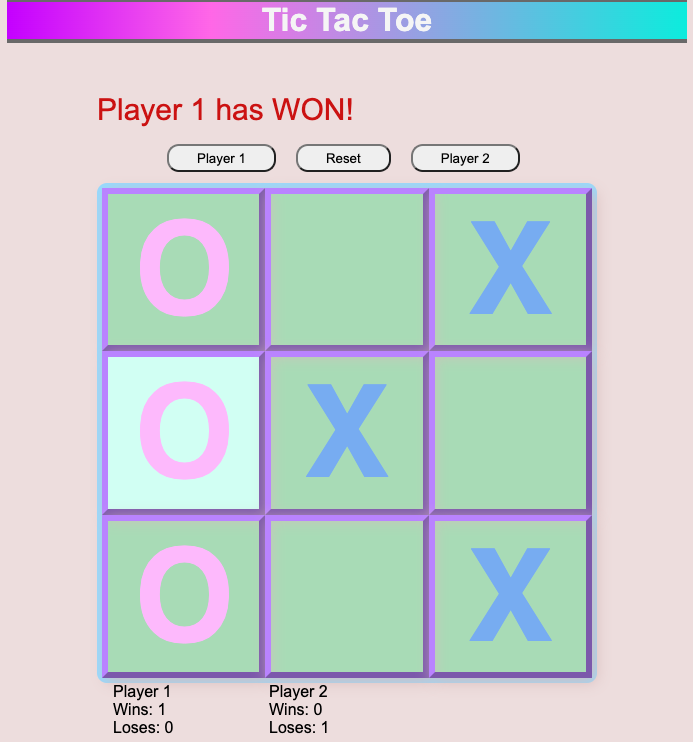

# Tic-Tac-Toe

  ## Description
  This web application is meant to be a simple application whereby two users on the same computer can play tic-tac-toe.  The application is hosted on GitHub pages.

  ## Technologies Used
  - HTML
  - CSS
  - JavaScript

  ## Setup/Installation
  1.  Clone this repository to your desktop.
  1.  Navigate to index.html and open in your browser.  The application can, also, be ran by clicking the application's GitHub link, https://wmsimien.github.io/TicTacToe/.

  ## Usage  
  Two players can become engrossed in playing Tic-Tac-Toe, by first selecting the player who will go first.  Clicking the 'Player 1' or 'Player 2' button will denote which player will go first and will have the 'X' mark; the other player will go second and will have the 'O' mark.  The first player or Player 1 will select the desired 'unplayed' square to play by clicking on it; their mark will appear there.  Then the second player or Player 2 will follow suit, selecting their desired 'unplayed' square to play by marking it.  The player button will indicate the next player with a defaulted color for that player.  Player 1 and Player 2 will continue to take turns marking their desired 'unplayed' square until one player gets three of their marks in a row (up, down, across, or diagonal) or all nine squares have been played.  GAME OVER; another game can be played by clicking the 'Reset' button, which will display 'Play' denoting the board is in a 'play' mode and ready after the first player has been selected.

  

  ## User Stories And Wireframe
  - As a user, I should be able to start a new tic tac toe game
  - As a user, I should be able to click on a square to add X first and then O, and so on
  - As a user, I should be shown a message after each turn for if I win, lose, tie or who's turn it is next
  - As a user, I should not be able to click the same square twice
  - As a user, I should be shown a message when I win, lose or tie
  - As a user, I should not be able to continue playing once I win, lose, or tie
  - As a user, I should be able to play the game again without refreshing the page

  
  ## Credits
    Wanda Avery
  
  ## Fun Level
  Great project w/ a high level of fun for all levels of developers.

                                                           
  